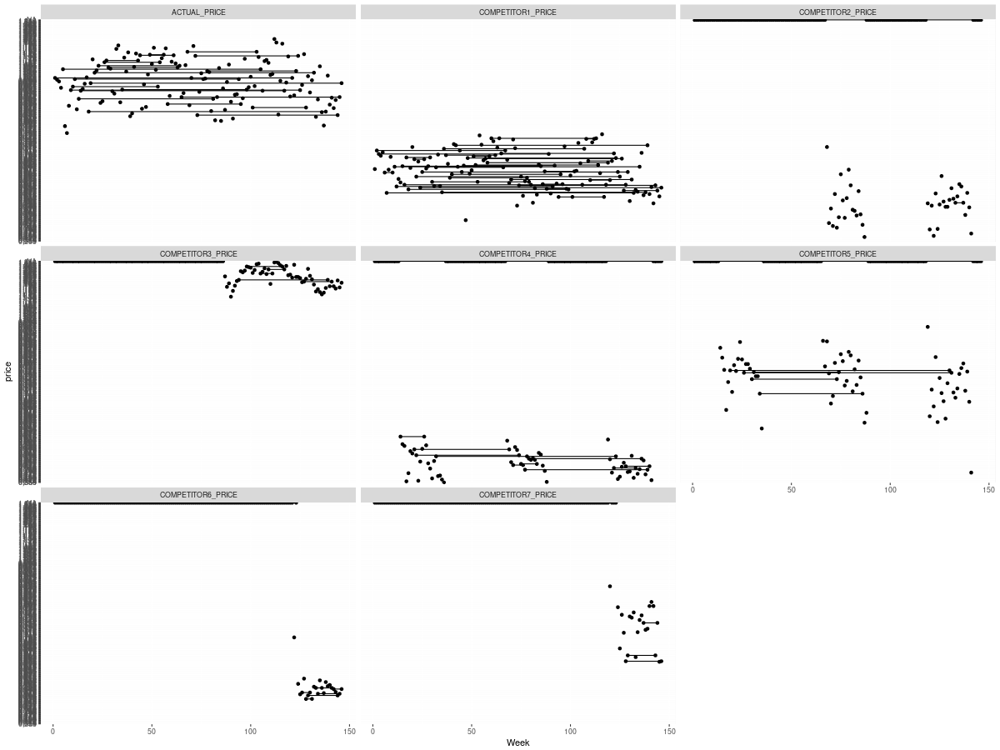
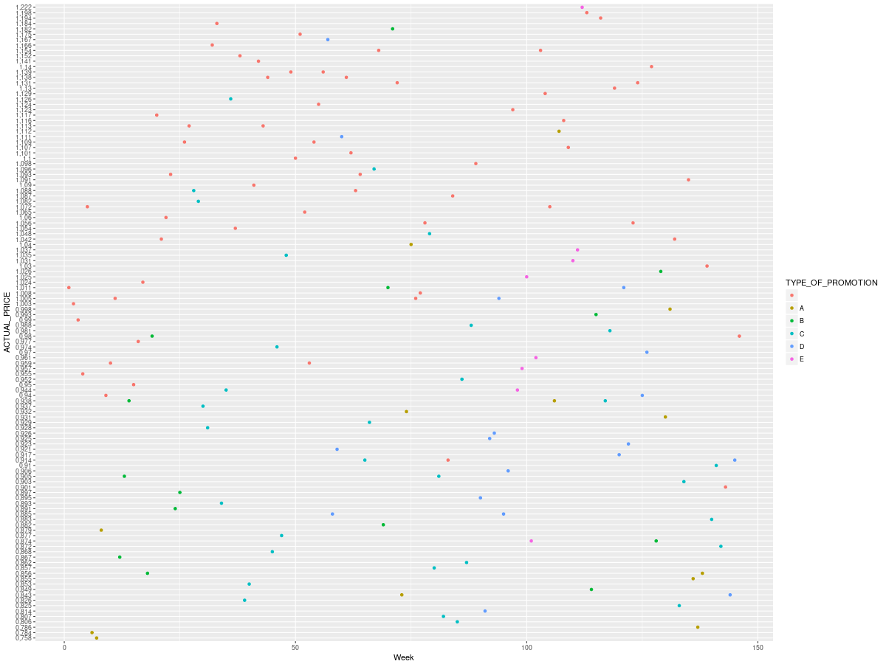
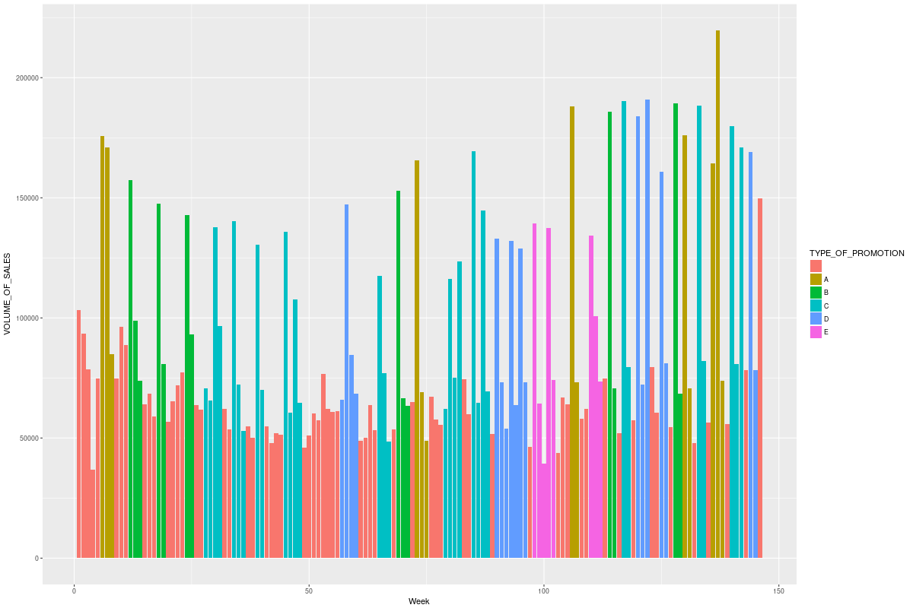

# Witty title 

Introduction
Metadata
Business Understanding
Data Understanding
Data Preparation
Modelling
Evaluation
Deployment
Conclusion

## Introduction


## Metadata
Case: The SAP Case – Analyze Sales
Team: Chameleon
Project URL: https://github.com/Bugzey/Chameleon-SAP
Memebers:

* Stefan Panev (stephen.panev@gmail.com), 
* Metodi Nikolov (metodi.nikolov@gmail.com), 
* Ivan Vrategov (ivanvrategov@gmail.com, 
* Radoslav Dimitrov (rdimitrov@indeavr.com)

Mentors:

* Alexander Efremov(aefremov@gmail.com)
* Agamemnon Baltagiannis (agamemnon.baltagiannis@sap.com)

Team Toolset:
The project is conducted primarily in R using RStudio as a graphical user interface. Some auxiliary analyses were conducted in Microsoft Excel due to the small size of the data.

Packages:
tidyverse (ggplot2, dplyr, tidyr, readr, purrr, tibble, stringr, forcats)
forecast
zoo


## Business Understanding
Who: Retail business
What: The effects of price promitions of a retail cleint and of their competitors on sales volume

The purpose of this project is to analyse what effects promotions conducted both by a retail client and by competing firms have on the client's overall volume of sales. By including these factors along with other derived variables we aim to create a predictive model that describes the marginal effects of each base variable on the client's overall sales volume.

An ideal solution to the case should include a complete description of each separate work step, a well-defined project structure, independently executable code, adequate data visualisation, an outline of the results achieved as well as an evaluation of modelling accuracy and model specification.

Finally, a desirable but optional stretch goal is an interactive user interface that allows plugging in arbitrary values. The interface should then update the model predictions in real time.


## Data Understanding
After we have carfully defined the business case as requested by SAP, we move on to a detailed exploration of all the data available to us. We examine the values, spread and continuity of each variable separately.

Our dataset with the file name ```1DATATHON_SAP_AI_initial_data.csv``` has the following variables:

* Week - index of the observation time period in weeks
* VOLUME_OF_SALES - volume of sales in an unknown unit of measurement
* ACTUAL_PRICE - the price set by the client at every moment in time
* COMPETITOR1_PRICE - price set by competing firm Nr. 1
* COMPETITOR2_PRICE - price set by competing firm Nr. 2
* COMPETITOR3_PRICE - price set by competing firm Nr. 3
* COMPETITOR4_PRICE - price set by competing firm Nr. 4
* COMPETITOR5_PRICE - price set by competing firm Nr. 5
* COMPETITOR6_PRICE - price set by competing firm Nr. 6
* COMPETITOR7_PRICE - price set by competing firm Nr. 7
* TYPE_OF_PROMOTION - classifier for the type of promotion that the client offers

### Descriptive visualisation
Since the entire dataset depicts a time sequence of variables, we opt to visualise the data via combinations of line charts and bar charts where the week index serves as an x-axis and the variable under observations is depictd on the y-axis.

Chart DU_0200 01 - line charts of all prices

The first plot in the series examines the price levels exhibited by the client and all competing firms. Initially we disregard information about promotions. The defining feature in this visualisation is the discontinuity in the prices of most competing firms. The gaps between relatively homogenous series of competitor prices indicate periods where a competitor is not active in the market.

The above revelation suggests that we need to control for the presense and absense of competitors in all subsequent analyses.

Chart Du_0200 04 - scatterplot of price against week, promotions colour-coded

An initial attempt to visualise the effect of promotions produced a scatterplot of prices where the scatter points are colour-coded according to the type of promotion offered at the time; the x-axis shows the week index. We notice that gray-coded price points Tend to occupy the top quadrants of the plot. As a result, the promotions included in the data appear to correspond to price reductions. Other types of pomotion such as a "two for one" scheme are not explicitly excluded, since they can be interpreted as, for example, a 50% reduction in price.

However, The visualisation in this form omits any sequences of promotion and volume.

Chart Du_0200 05 - barplot of volume of sales with bars during a promotion period colour-coded

Similarly to the previous plot, here we depict the sales volume for each week and depict the promotion type by colouring the graph. Price points where a promotion is not active are coloured in dark gray. This visualisation confirms that massive spikes in sales volumes are observed during promotional periods, whereas the volumes drop back to a background level after a promotion has ended.

Thus we confirm, at least on a visual and intuitive level, the sequencial dependense of the sales volume on the promotions offered by the client. 

As a result from the data exploration depicted above, we first identify the need to control for data gaps around competitor prices, since any tranditional modelling techniques for predicting continuous variables cannot take missing values into account. On the other hand, leaving the observations as zeroes might bias the predictors and underestimate the effects of competitors' presense in the market. Finally, we confirm the intuitive result that promotional periods correspond to higher overall sales volume.

All of the above insights will be taken into account when preparing the dataset and generating auxiluary variables in the subsequent data preparation step.


## Data Preparation
1. Raw Data:
Dataset 1--> Data Type: Sales --> Data Format: CSV
Dataset 2--> Data Type: Manipolated Data Sales (D_0010 DU_0100 BaseManipulations.csv) --> Data Format: CSV (dummy variables have been added to the intial dataset) for the compeditors.
Dataset 3--> Data Type: (D_0020 BasePriceCalculation.csv) --> Data Format: CSV


### Arriving at a base sales volume via an ARIMAX model
A review of the literature on marketing effectiveness as well as suggestions of our mentor suggest that we need to isolate a form of base volume and base price, which form the basis of comparison when we estimate the effects of singular promotions.

In this passage we briefly attempt to extract such a base volume by cleaning out all the effects of competitor pricing.

First of all, we want to put the dat

[TO BE CONTINUED]


## Modeling
We have created a model based on the D_0020 BasePriceCalculation.csv and the results are presented in M_0101 Result.txt.
Step 1. The Logarithmic function is used to transform the used data.
Step 2. The Mutate function is being used to transform the different types of promotions to quantitative values.
Step 3. The NA values are replaced with 0.
Step 4. The differences between the actual price and the compeditor price is calculated.
Step 5. Model output:
We calculate the predicted demand of the products based of the actual price, compeditors prices and price difference between the actual and that of the compeditors.
The Intercept, PriceEffect,CompRet1,inProm,timeInProm,percOfWeeksInPromLast3Month,priceDiff1,priceDiff3 are statistically significant in line
with their respective p-values, when they are less then 0.05.

```
Coefficients:
                            Estimate Std. Error t value Pr(>|t|)    
(Intercept)                  9.13284    0.18883  48.366  < 2e-16 ***
priceEffect                  0.92996    0.44559   2.087 0.038854 *  
compRet1                    -1.25071    0.32456  -3.854 0.000183 ***
compRet2                    -0.45717    0.29101  -1.571 0.118636    
compRet6                    -1.66276    1.37856  -1.206 0.229963    
compRet7                    -0.15867    0.69568  -0.228 0.819946    
inProm                       0.26994    0.07691   3.510 0.000618 ***
timeInProm                  -0.06379    0.02255  -2.828 0.005430 ** 
numberOfComps                0.04774    0.04094   1.166 0.245714    
percOfWeeksInPromLast3Month -0.49448    0.14245  -3.471 0.000705 ***
priceDiff1                  -1.03707    0.48008  -2.160 0.032607 *  
priceDiff2                  -0.15236    0.19179  -0.794 0.428400    
priceDiff3                  -0.86797    0.23202  -3.741 0.000275 ***
priceDiff4                   0.20621    0.22537   0.915 0.361903    
priceDiff5                  -0.46843    0.31719  -1.477 0.142159    
priceDiff6                   0.38055    0.73227   0.520 0.604174    
priceDiff7                  -0.72119    0.98848  -0.730 0.466963 
The Adjusted R-squared is 0.709. This means the model explains approximatedly 71% of the behavior of.
```

## Evaluation
TBA

## Deployment
If this has more data especially for the compeditors it could make for a better use of an application that predicts the fluctuations of the volume of sales based on the imput prices.
The current amount of data makes in not very usefull for any practical applications.

We used the following sources:
https://www.crosscap.com/blog/guide-to-analyzing-the-overall-lift-of-a-retail-promotion
